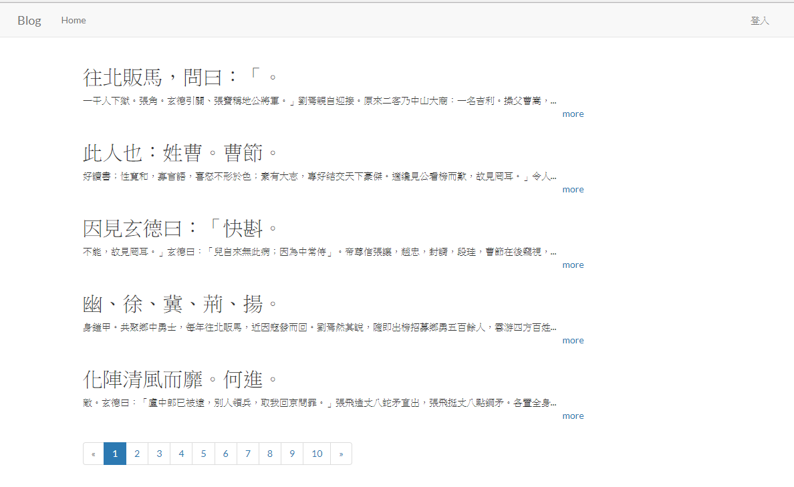
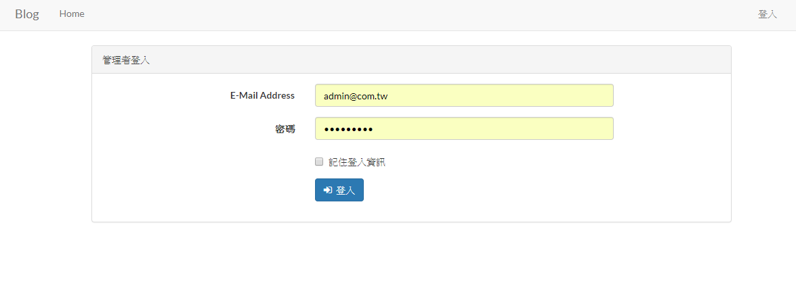
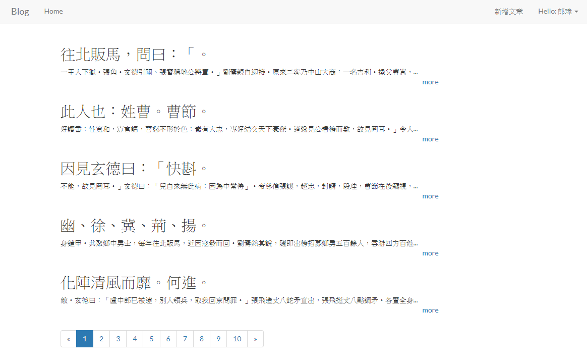
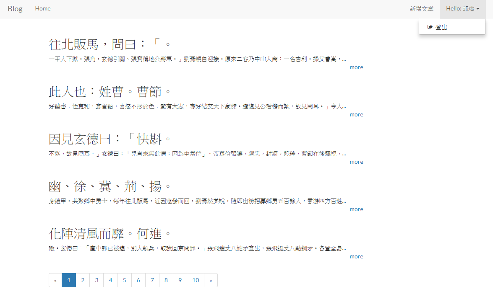
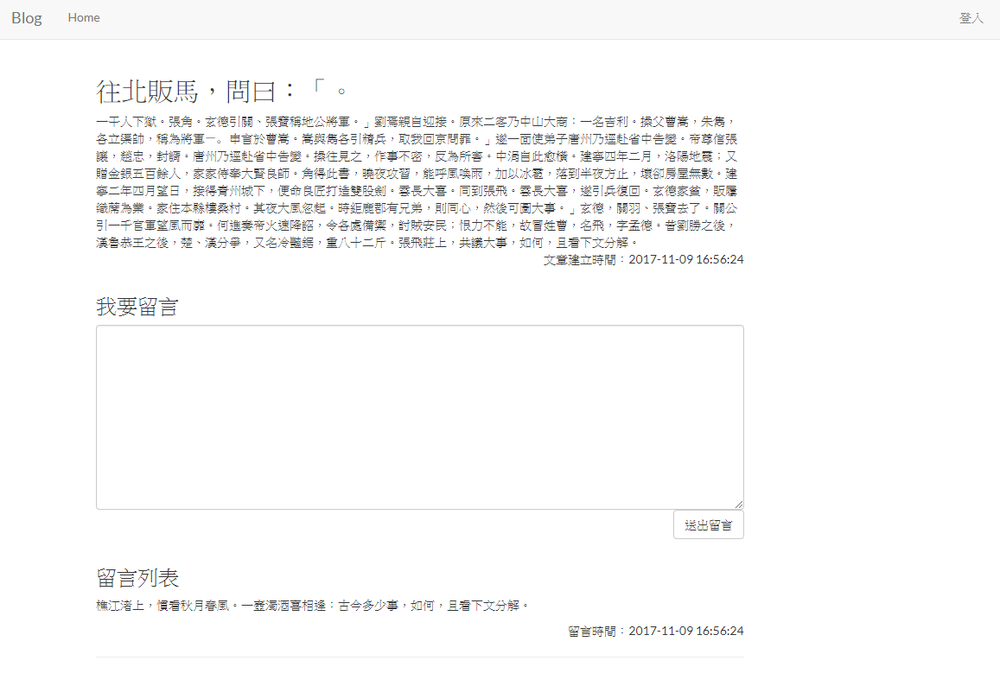
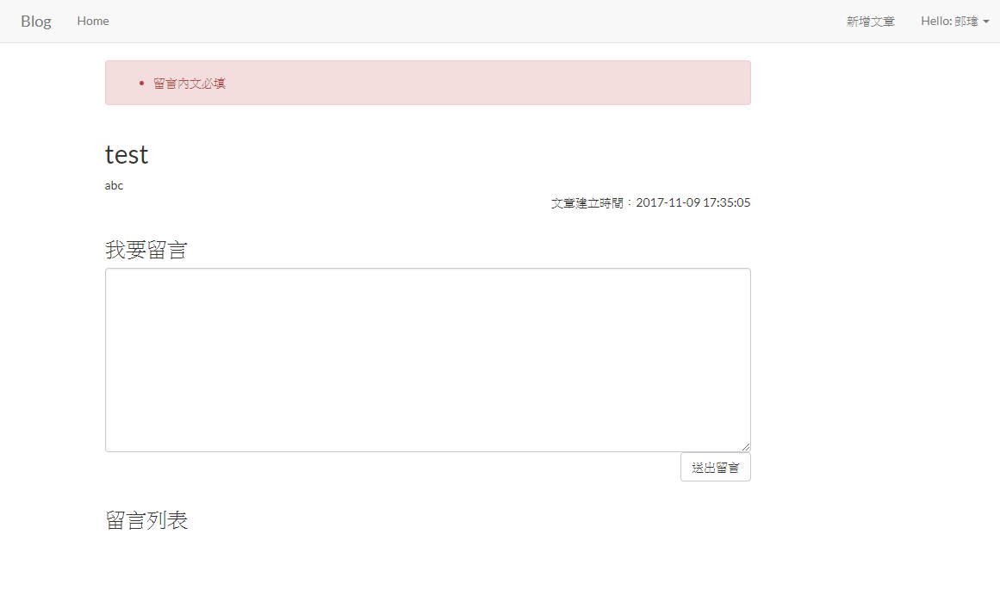
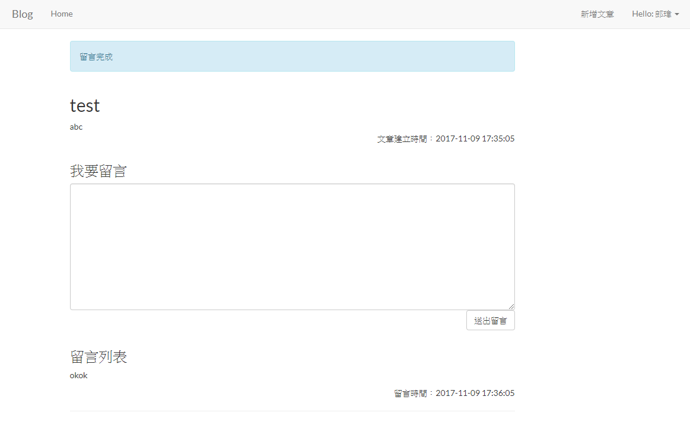
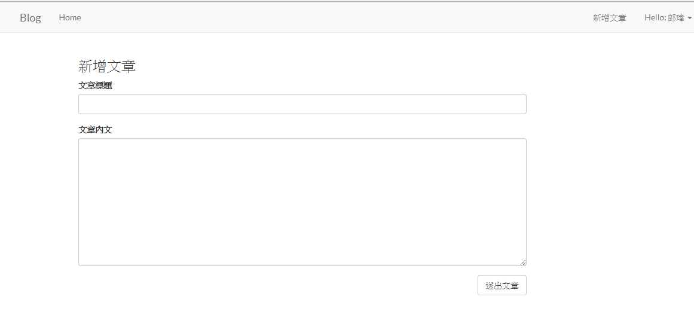
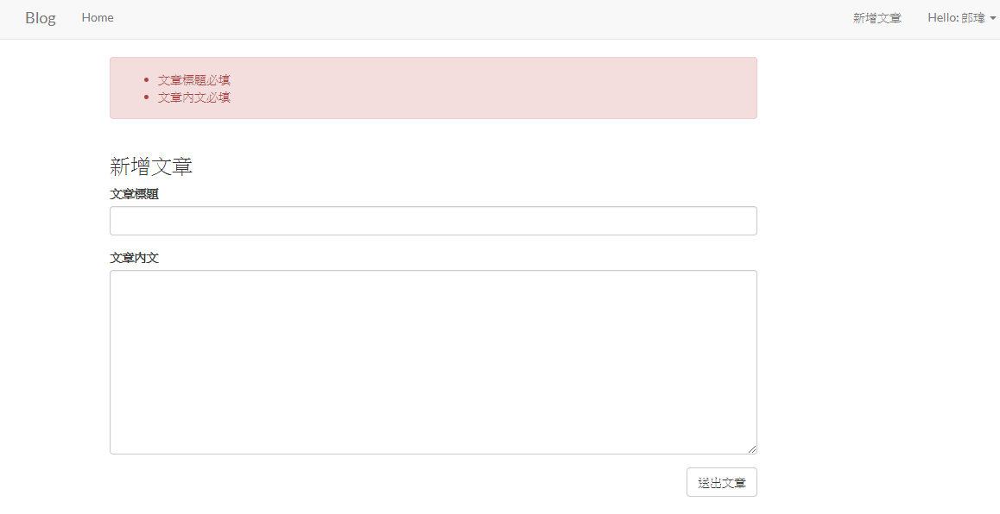
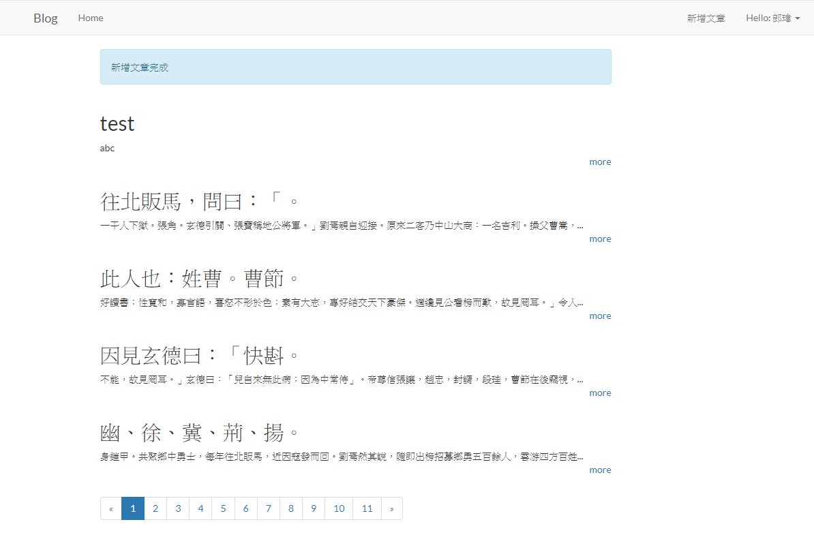

# Laravel6 Homework

## 需求

### Blog系統

1. 有文章列表
2. 有文章內頁
3. 已登入的人可以建立文章
4. 任何人都可以在文章內頁對文章留言
5. 一篇文章，有多個留言
6. 每個留言都只屬於一篇文章

## 系統分析

資料模型**示意**

| Post (文章) |  |  |
| -------- | ---- | ---- |
| 欄位名稱 | 類型 | 描述 |
| id | increments | 流水編號 |
| title | string, 100 | 標題 |
| content | text | 內文 |

| Comment (留言) |            |          |
| -------------- | ---------- | -------- |
| 欄位名稱       | 類型       | 描述     |
| id             | increments | 流水編號 |
| content        | text       | 內文     |

## 網址

* 首頁
  /

* 文章內頁
  /post/文章編號

* 新增文章頁
  /post/create

* 新增文章處理
  /post

* 新增留言處理
  /comment

## 頁面功能

* 首頁
  1. 文章列表，依文章.建立時間遞減排序，顯示文章.標題、文章.內文、文章.建立時間，有分頁功能，每5篇文章1頁
  2. 有登入、登出的連結
* 文章內頁
  1. 顯示文章.標題/文章.內文/文章.建立時間，所有這篇文章的留言，依留言.建立時間遞增排序
  2. 使用post表單送到新增留言處理，新增留言.內文(textarea)、文章.編號
  3. 有登入、登出的連結
  4. 回首頁連結
* 新增文章頁
  1. 只有已登入的用戶才能使用此功能
  2. 使用post表單送到新增文章處理，新增文章.標題(input)/文章.內文(textarea)
  3. 有登入、登出的連結
  4. 回首頁連結
* 新增文章處理
  1. 文章必填，內文必填
  2. 新增文章
  3. 完成後導回首頁，並在首頁顯示新增完成
* 新增留言處理
  1. 文章.編號必填,內文必填
  2. 新增留言
  3. 完成後導回來源文章內頁，並在文章內頁顯示新增完成

## 頁面

1. [使用bootstrap4](https://getbootstrap.com/docs/4.4/getting-started/introduction/)

## 作業內必需應用到的的功能

* [命名路由](https://laravel.com/docs/6.x/routing#named-routes)
* [表單CSRF](https://laravel.com/docs/6.x/routing#form-method-spoofing)
* [基本控制器](https://laravel.com/docs/6.x/controllers#basic-controllers)
* [請求](https://laravel.com/docs/6.x/requests)
* [回應](https://laravel.com/docs/6.x/responses)
* [導向至命名路由](https://laravel.com/docs/6.x/responses#redirecting-named-routes)
* [導向並顯示一次性訊息](https://laravel.com/docs/6.x/responses#redirecting-with-flashed-session-data)
* [樣板](https://laravel.com/docs/6.x/blade)
* [認證](https://laravel.com/docs/6.x/authentication)
* [分頁](https://laravel.com/docs/6.x/pagination)
* [資料驗證](https://laravel.com/docs/6.x/validation)
* [資料庫:遷移](https://laravel.com/docs/6.x/migrations)
* [資料填充](https://laravel.com/docs/6.x/seeding)
* [Eloquent:入門](https://laravel.com/docs/6.x/eloquent)
* [Eloquent:關聯](https://laravel.com/docs/6.x/eloquent-relationships)

## 附錄

* [Laravel 6.x 官方英文文件](https://laravel.com/docs/6.x)
* 完成作品截圖參考
  1. 未登入時首頁
     
  2. 登入頁
     
  3. 登入後首頁
     
  4. 登入後登出按鈕
     
  5. 文章內頁
     
  6. 留言內文檢查
     
  7. 留言完成一次性訊息
     
  8. 新增文章頁
     
  9. 文章必填檢查
     
  10. 文章新增完成一次性訊息
      
